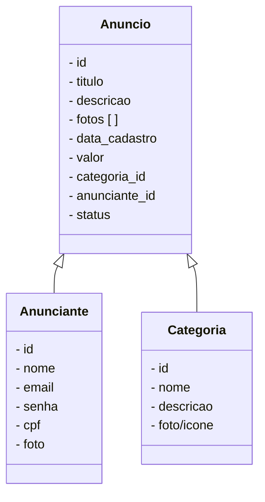

# Diagrama de Classes

### Entidades principais
- Anuncio
- Anunciante
- Categoria

- Plano (anunciante.tipo)
- Avaliações
- Endereco
- InformacoesDeContato

```mermaid
classDiagram
    Anuncio <|-- Anunciante
    Anuncio <|-- Categoria

    class Anuncio {
      - id
      - titulo
      - descricao
      - fotos [ ]
      - data_cadastro
      - valor
      - categoria_id
      - anunciante_id
      - status
    }

    class Anunciante {
      - id
      - nome
      - email
      - senha
      - cpf
      - foto
    }

    class Categoria{
      - id
      - nome
      - descricao
      - foto/icone
    }
```